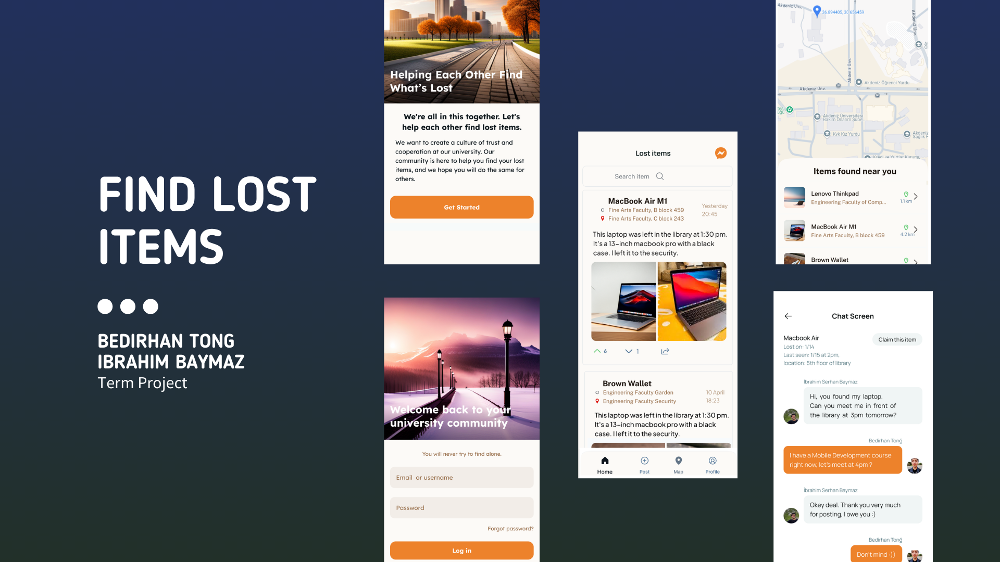

# **Lost & Found Items University App**

#### **Find Lost Items** aims to help students and staff at the university easily report, find, and communicate about lost and found items.

## Features

- **View Detailed Lost Item Listings**: Users can browse a comprehensive list of lost item reports, complete with detailed descriptions and images of the items.

- **Messaging**: Users can directly message each other regarding specific listings to ask questions or arrange for item retrieval.

- **Upload Listings**: Users can easily upload their own lost item reports, providing necessary details to help others assist in their search.

- **Rate Listings**: Users can evaluate listings based on their usefulness and accuracy, helping to improve the quality of information shared within the app.

- **Map Exploration**: Users can explore an interactive map to see the locations where items have been found, enabling them to check for items that may have been lost in similar areas.

## Technology Stack

- **Jetpack Compose**: A modern toolkit for building native UI in Android, which allows for a more declarative approach to designing user interfaces, resulting in cleaner and more maintainable code.

- **Clean Architecture**: This design pattern helps in separating concerns and making the codebase more scalable and testable, allowing for easier maintenance and future enhancements.

- **Coil**: An image loading library for Android that efficiently loads and displays images

- **Paging 3**: A library that simplifies loading large datasets by providing a paginated approach.

- **Retrofit**: for communication with RESTful APIs and handle network requests and responses.

- **Firestore Database**: A flexible, scalable NoSQL cloud database.

- **Firebase Analytics**: A powerful analytics tool that helps track user behavior.

- **Dagger Hilt**: A dependency injection library
