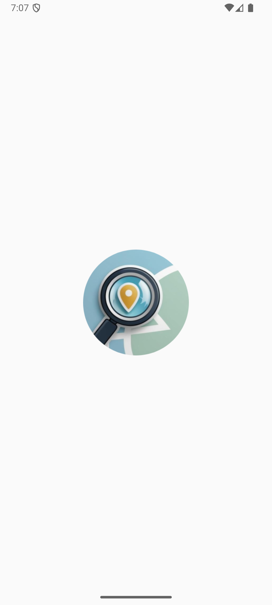
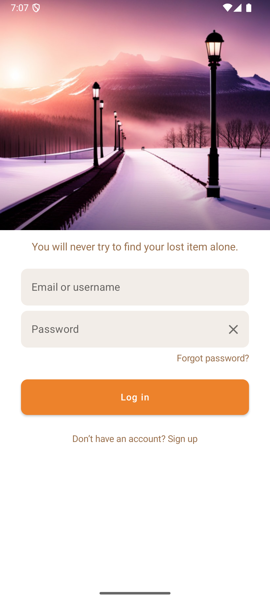
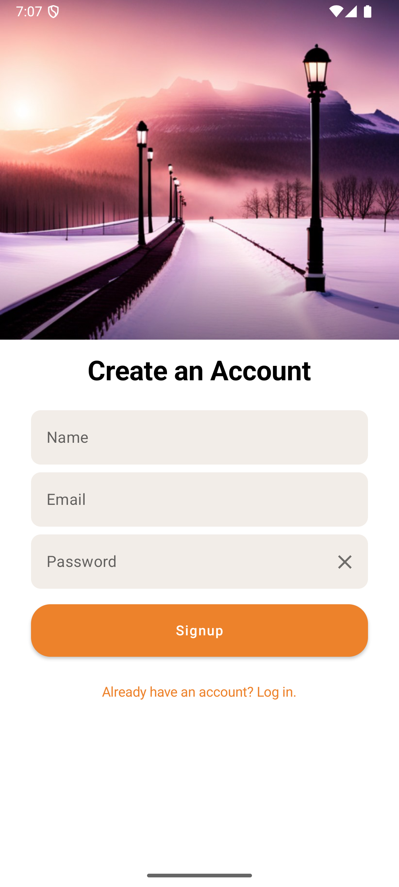
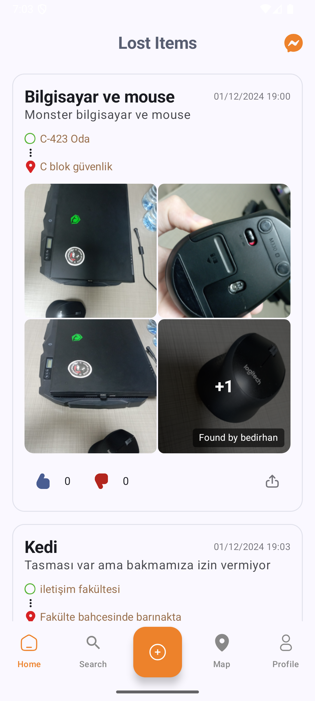
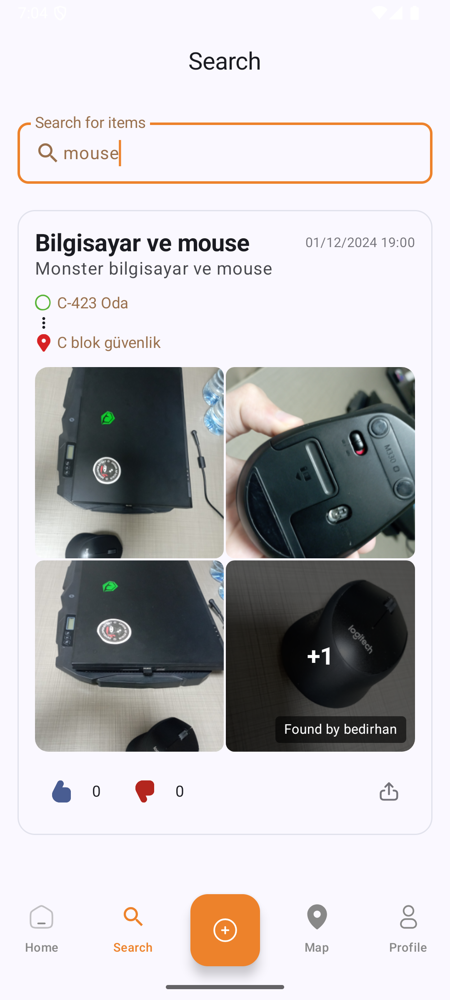
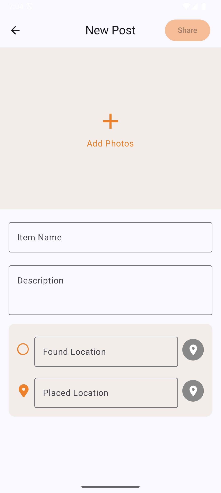
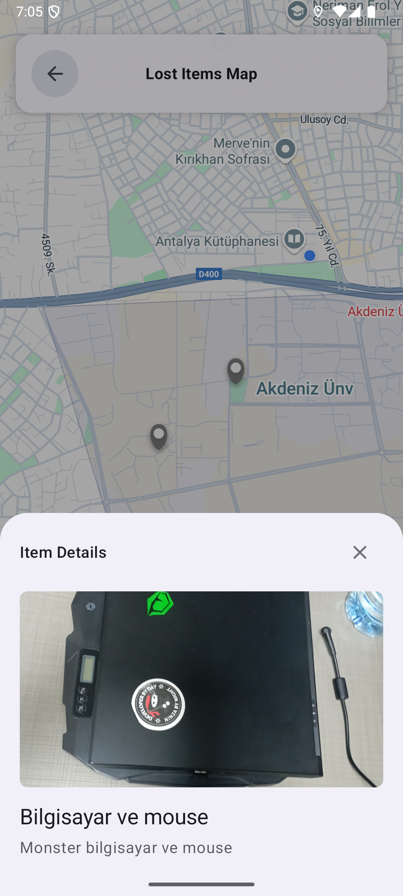
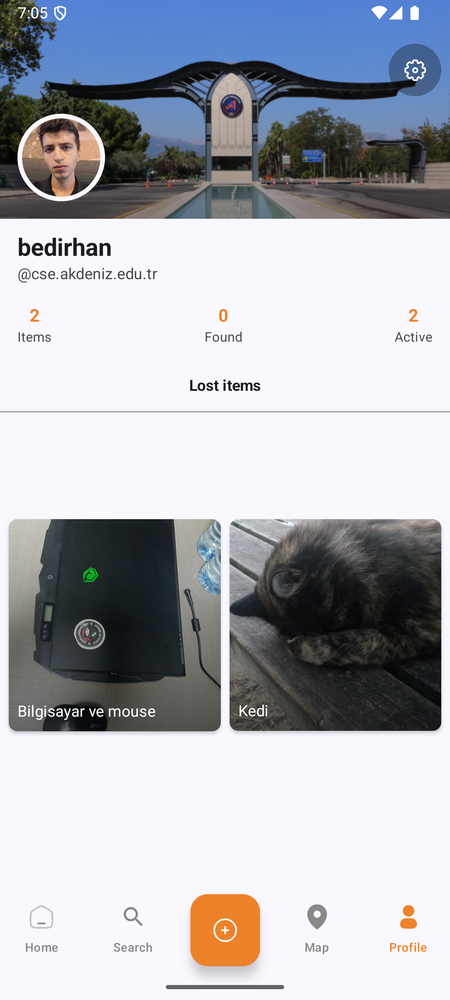
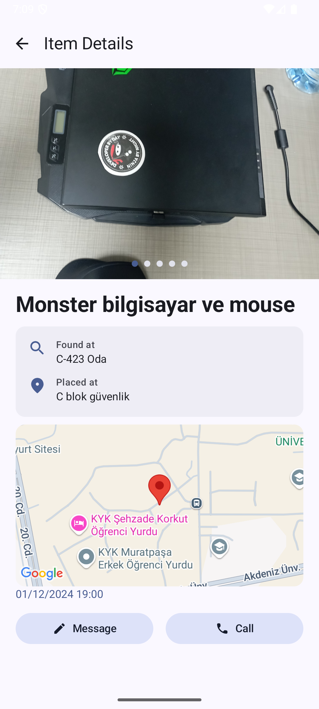

  
  <h1>Lost & Found Items University App</h1>
  

    <strong>Find Lost Items aims to help students and staff at the university easily report, find, and communicate about lost and found items.
</strong>
  

## ✨ Features

<b>🎯 Core Features</b>

* **Lost Item Management**
  - Report found items with multiple images
  - Detailed item descriptions
  - Precise location marking
  - Real-time status updates

* **Location Features**
  - Interactive campus map
  - Location clustering
  - Custom map styling
  - Location selection for found items

<b>💬 Communication</b>

* **Messaging System**
  - Direct messaging between users
  - Real-time chat updates
  - Message history
  - User status indicators

* **Notifications**
  - New message alerts
  - Item status updates
  - Location-based notifications

## Screenshots

| splash | login | signup |
|:-:|:-:|:-:|
|  |  |  |
| home | search | post |
|  |  |  
| map | profile | movie detail |
|  |  |  

## 🛠️ Technology Stack

<b>📱 Frontend</b>

* **UI Framework**
  - Jetpack Compose
  - Material 3 Design
  - Custom Composables
  - Navigation Component

* **State Management**
  - ViewModel
  - Kotlin Flow
  - StateFlow

<b>🔧 Backend & Data</b>

* **Firebase Services**
  - Authentication
  - Firestore
  - Storage
  - Analytics

* **Local Storage**
  - SharedPreferences
  - Room Database (planned)

<b>📚 Libraries</b>

* **Dependency Injection**
  - Dagger Hilt

* **Image Loading**
  - Coil

* **Maps**
  - Google Maps SDK
  - Maps Compose

* **Other**
  - Kotlin Coroutines
  - Android KTX

## 🔒 Security

<b>ProGuard Rules</b>

* **Model Classes Protection**
  - Keep data models
  - Preserve Firebase classes
  - Protect Compose components

* **Library Configurations**
  - Hilt ProGuard rules
  - Navigation component rules
  - Model class preservation

